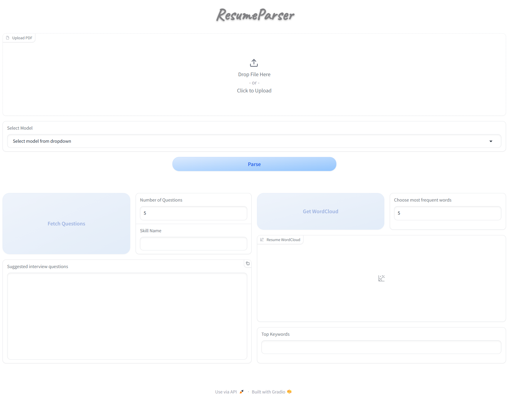
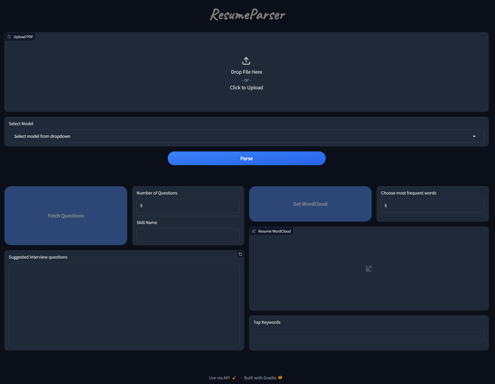
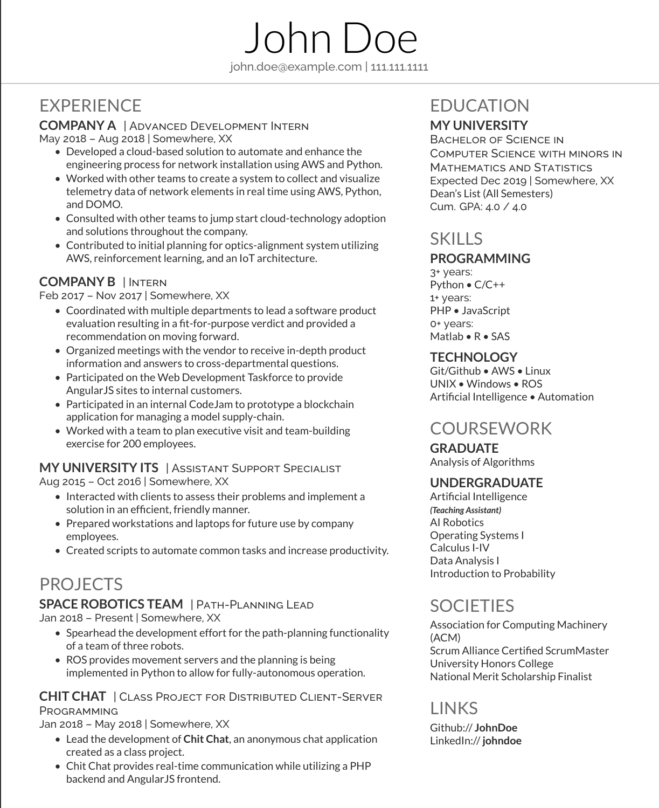
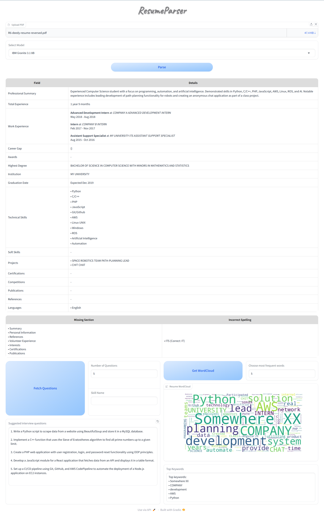

<i>**Important**: This application is currently in the testing phase. You might encounter bugs or issues while using it. We appreciate your understanding and patience.</i>

# ResumeParser


<div align="center">
  
<!-- First Row -->
<a href="#"></a>
<a href="#"></a>
<a href="#"></a>
<a href="#"></a>

<!-- Second Row -->
<a href="#"></a>
<a href="#"></a>
<a href="#"></a>
<a href="#"></a>

</div>

## 📋 Overview
ResumeParser is a powerful AI-driven tool that streamlines resume analysis by automatically extracting and analyzing key information from resumes. Built for recruiters and HR professionals, it combines advanced NLP with efficient processing to deliver accurate insights.

## ✨ Key Features

**Core Capabilities**
- 📄 Intelligent parsing for PDFs with mutliple LLM model support
    - Hermes LLama3.1 8B - 8 Bit quantized model
    - Hermes LLama3.2 3B - 8 Bit quantized model
    - IBM Granite 3.1 8B - 8 Bit quantized model

- 🔍 Missing section identification
- ✍️ Advanced spell checking analysis
- 💡 AI-powered interview question generation
- 📊 Visual resume analysis with WordCloud generation

## 🖥️ Application Interface

<div align="center">
  <table>
    <tr>
      <td></td>
      <td></td>
    </tr>
    <tr>
      <td align="center"><i>ResumeParser LIGHT</i></td>
      <td align="center"><i>ResumeParser DARK</i></td>
    </tr>
  </table>
</div>

## 🛠️ Tech Stack

| Category             | Technologies                     |
|----------------------|----------------------------------|
| **Backend**          | FastAPI, Python 3.8+             |
| **ML/AI**            | PyTorch, Transformers            |
| **UI**               | Gradio                           |
| **Document Processing** | IBM Docling                   |
| **Local LLM Software**      | LM Studio                 |
| **LLM Models**        | Llama 3.x, IBM Granite          |

---

## 📋 Prerequisites

Before running the application, ensure your system meets the following requirements:

- **Python**: Version 3.10 or higher
- **RAM**: Minimum 8GB (16GB recommended)
- **GPU**: Recommended for optimal performance (NVIDIA RTX 3050 or higher)

### Reference System Specifications
- **RAM**: 16 GB DDR5
- **GPU**: NVIDIA RTX 3060 (6GB)
- **Processor**: Intel i7-12700H


## 🚀 Getting Started

### Create and activate virtual environment

```bash
python -m venv venv
source venv/bin/activate  # Windows: venv\Scripts\activate
```

### Clone repository
```python
# clone repo
git clone https://github.com/SID-SURANGE/ResumeParser.git
cd ResumeParser

# Install dependencies
pip install -r requirements.txt
```
### Set up environment variables
Use the below command to store the HuggingFace API key and other API keys for future integrations.(Optional for current setup)
```
cp .env.example .env
```

### LM Studio

#### Download & Install LM Studio
<div align="center">
    <a href="https://lmstudio.ai/">
        
    </a>
</div>

After installation:
1. Download preferred models from LM Studio's built-in model hub.
2. Currently the tested models are **Hermes LLama3.1 8B, Hermes LLama3.2 3B, IBM Granite 3.1 8B - 8 Bit quantized model**
3. Load and start the local server for model inference
4. Keep the server running while using ResumeParser

### Usage Guide
Watch step-by-step tutorial on Youtube by [Developers Digest](https://www.youtube.com/@DevelopersDigest):
<div align="center">
    <a href="https://youtu.be/SUeIsSML2UY">
        
    </a>
</div>


## 💻 Usage

Once LM Studio is configured and its server is started up, follow below steps -

### Starting Application

```bash
# development mode, 
uvicorn main:app --reload

# production mode
uvicorn main:app --host 0.0.0.0 --port 8000 --reload
```

### Accessing the Application

- Access the web interface at http://localhost:8000
    - Theme can be modified by appending to url - http://127.0.0.1:8000/?__theme=light or http://127.0.0.1:8000/?__theme=dark
- Upload a PDF resume (***works best for 1 page resumes***)
- Select an LLM model
- Click "Parse" to analyze the resume
- Use additional features (enabled only after Parse button click):
    - 🤔 Generate interview questions
    - 📊 Create word clouds

## 🌐 API Endpoints
| Category | Endpoints | Description |
|----------|-------------|------------|
|Resume parsing <li>Data extraction</li> <li>Missing Section </li> <li>Spell Issues</li> | /api/v1/parse| Parse Uploaded resume
|Question generation <li>With extracted skillset</li> <li>Adhoc Skill based question</li>|/api/v1/questions| Generate interview questions |

API documentation is available at `http://localhost:8000/docs`.

## Sample Output Preview

<div align="center">
  <table>
    <tr>
      <td></td>
      <td></td>
    </tr>
    <tr>
      <td align="center"><i>Input Resume (<a href="https://www.overleaf.com/latex/templates/deedy-resume-reversed/hqnwfgjbbddt">Overleaf Template</a>)</i></td>
      <td align="center"><i>Parser Output</i></td>
    </tr>
  </table>
</div>

## 🔄 Future Enhancements

We are actively working on adding new features:
- 💼 Intelligent job role matching.
- 📄 Multi-page resume support.
- 🤖 Integration with advanced models like Claude and OpenAI.

## ⚠️ Troubleshooting

### Common Issues:
- 🖥️ **Model Loading Errors**: Ensure GPU requirements are met.
- 📁 **File Processing Issues**: Verify that only PDF files are uploaded.
- 💾 **Memory Errors**: Increase system RAM or optimize workloads.

### Known Issues:
- 🔍 Error messages need better user clarity.
- 🛠️ Handling unexpected model responses.
- 📑 Multi-page document support is under development.
- 📊 Complex document handling (e.g., tables, graphics) is being improved.

## 📄 License
Licensed under MIT License. See [LICENSE](./LICENSE.txt) for details.

## 📬 Contact & Support

For any issues or feature requests:
- 🐛 Report bugs via GitHub Issues.

---


Made with ❤️ by the ResumeParser Team


If you find this project useful, please consider giving it a star ⭐ and forking it 🍴. Your support is greatly appreciated!